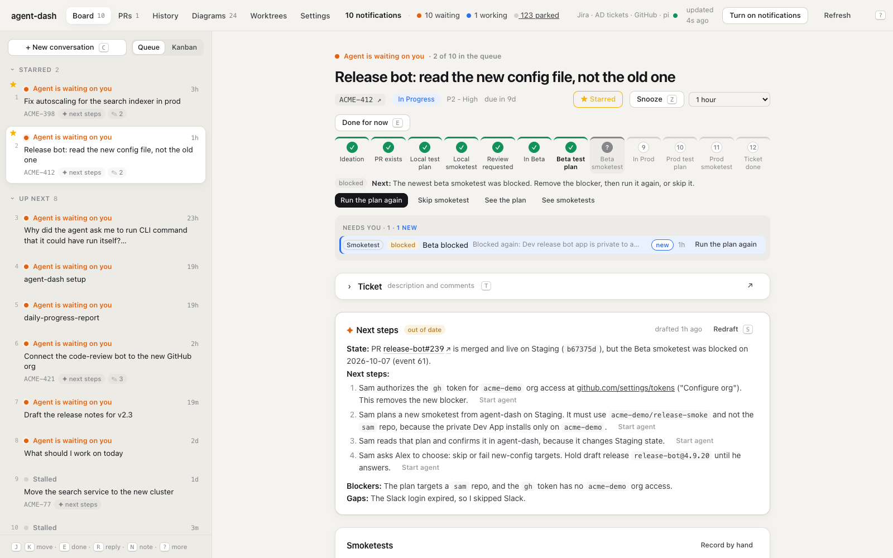

# agent-dash

A local dashboard for one person who oversees many coding agents at the same time.

**It is the bridge of a ship, for software engineering.** A captain does not run to the engine room to change speed. The captain moves the engine telegraph on the bridge, and the crew does the work. agent-dash does this for a developer: you see your agents, tickets, PRs, reviews, smoketests and deploys on one page, and you give each order from there. Your coding agents are the crew.



- **See what needs you.** One queue, ranked by urgency, with a short summary of what each agent did and what it needs from you.
- **Act from the page.** Start, reply to and stop agents. Move Jira tickets, request reviews in Slack, fix a red PR, and plan and run smoketests, without a terminal tab.
- **Keep control.** It runs on your machine only, and each write starts with your click.

For a tour with screenshots, see [docs/capabilities.md](docs/capabilities.md). The rest of this README is the reference.

**The goal: one place for the whole developer workflow.** You find the next task, start agents, talk to them, and follow their PRs on this page, so you do not switch between iTerm and agent-dash. Each new feature moves one more step of the workflow from the terminal onto the page.

It reads the session logs of your coding agent ([pi](https://github.com/badlogic/pi-mono) or [Claude Code](https://docs.claude.com/en/docs/claude-code), see [Choose the agent](#choose-the-agent)), your Jira tickets, and your GitHub PRs. You can act on the answer without leaving the page.

The dashboard writes two things to Jira itself: a due date and a status move, from the [Ticket](#the-ticket-section) section or a drafted next step. It posts one thing to Slack as you: a [review request](#prs) when you click its **Post to Slack**. It never writes to GitHub. The other things it sends go to your own agent sessions: a reply that you type, a Stop, and the answer to an extension dialog. A [PR verb](#pr-verbs) button starts an agent on one small task, and that agent does the write: the click is your approval.

## Run it

You need macOS, and these on your `PATH`:

| Tool | For | Check |
|---|---|---|
| Node 24 or later, and pnpm | the server; Node runs the TypeScript directly | `node -v` |
| [pi](https://github.com/badlogic/pi-mono) or [Claude Code](https://docs.claude.com/en/docs/claude-code) | the agents that the dash reads and starts | `pi --version` or `claude --version` |
| `gh`, logged in | your PRs, CI and reviews | `gh auth status` |
| A Jira API token | your tickets ([make one](https://id.atlassian.com/manage-profile/security/api-tokens)), in a file with a `JIRA_API_TOKEN=…` line | |

Optional: `jira` ([jira-cli](https://github.com/ankitpokhrel/jira-cli)), which next-steps summaries use to read comments; `agent-browser` and a saved Slack login, for Slack search in summaries; pi-mcp-adapter with a `slack` server, to post review requests; iTerm2, for **Open in iTerm**.

```bash
git clone git@github.com:pgragg/agent-dash.git && cd agent-dash
pnpm install
pnpm install-extension   # once: exact run status and replies (see below)
pnpm build && pnpm start # http://127.0.0.1:7777
```

Until the settings are set, a banner on every view says what is missing, and the top bar says **Jira off**, not **Jira down**. Click **Set it up for me** in the banner to let an agent find your settings (see [Set it up for me](#set-it-up-for-me)), or open **Settings** (`#/settings`) and set them yourself: pick the agent first, with the **pi** / **Claude Code** toggle at the top, then your Jira login and token file, your ticket projects, and the other paths that you use. Each setting shows an example value and how to find it. Then restart. The settings go in `agent-dash.config.json`, which git ignores. See [Configuration](#configuration).

To start it and open the page with one command, add this to `~/.zshrc` (change the folder to your clone):

```bash
dash() {
  local url="http://127.0.0.1:7777"
  curl -s -o /dev/null --max-time 2 "$url/" && { open "$url"; return; }
  ( until curl -s -o /dev/null --max-time 1 "$url/"; do sleep 0.5; done; open "$url" ) &!
  ( cd ~/agent-dash && pnpm start )
}
```

`pnpm dev` runs the server with `--watch` and Vite on http://127.0.0.1:7778.

## Choose the agent

The **Agent** toggle at the top of Settings (`agent`: `pi` or `claude`) picks one agent for the whole dash. After a restart, every place uses it:

- **The board** reads that agent's session logs only: `~/.pi/agent/sessions` for pi, `~/.claude/projects` for Claude Code. `server/sources/sessions.ts` turns a Claude Code transcript into pi's log shape (`asPiLog`), so one parser finds the tickets, PRs, diagrams and status in both.
- **Agents on the page** (Start a new agent, next steps, lanes, smoketests, PR verbs, plain conversations) start headless. Claude Code runs as `claude -p --input-format stream-json --output-format stream-json --permission-prompt-tool stdio`, with the same stdin FIFO and log as pi's rpc mode. **Open in iTerm** starts `claude --session-id … --name …` with the context inline, and **Copy resume** gives `claude --resume <id>`.
- **Summaries and drafts** (next steps, conversation summaries, review requests) run `claude -p --no-session-persistence`, so they do not show on the board. The default draft model is `haiku`; `AGENT_DASH_DRAFT_MODEL` and `AGENT_DASH_SUMMARY_MODEL` still win.
- **Run status** comes from `extension/claude-status-hook.ts`, which writes the same status file as the pi extension. agent-dash passes the hooks with `--settings` to each Claude Code that it starts. `pnpm install-extension` adds them to `~/.claude/settings.json` too, so a session that you start in a terminal also reports.

What Claude Code cannot do here:

- **No Steer.** A message to a working agent waits until its turn ends. **Stop** works: the server sends an `interrupt` control request.
- **Replies from the page go only to a headless run.** A Claude Code in a terminal reads only its own keys, so its card says to reply in the tab.
- **Dialogs are tool permissions.** When Claude Code asks before a tool call, the card shows "Allow Write: /path?" with **Yes** and **No**. Yes runs the tool as asked; No and Stop deny it.

## The page

The navbar at the top switches between the views: **Board** (`#/`, the queue and workspace below), **PRs** (`#/prs`), **History** (`#/history`) and **Documents** (`#/documents`). A conversation has its own page (`#/c:<sessionId>`), and so does each document (`#/doc:<id>`). Each object has its own [address](#addresses).

### Board

- **Left: the queue.** One entry per ticket (or per ticket-less run or PR), ranked by its most urgent signal (see [Queue ranking](#queue-ranking)). Under it: **Waiting on others** (only context left, such as a PR out for review, or an agent whose only ask is that a reviewer approves its PR), **Done tickets** (closed tickets that still have agents open, tagged green **done**; never in the queue), **Agents at work**, **Agents finished** (agents that stopped and whose [summary](#conversation-summaries) says they need nothing; never in the queue, unless a smoketest of theirs still needs you), **Done for now**, and **Quiet tickets** (your tickets with nothing going on). An entry with several signals shows the most urgent one, with the others as tags: for example "Agent is waiting on you" with **in review**.
- **Right: a workspace for the selected entry.** In order: the [SDLC progress bar](#sdlc-progress-and-smoketests), why the entry is in the queue (each PR signal with its [verb button](#pr-verbs)), the [Ticket](#the-ticket-section) section, the drafted [next steps](#next-steps-summaries), the [Smoketests](#sdlc-progress-and-smoketests), **Start a new agent**, your notes, the [Documentation](#documents), each live agent's [summary](#conversation-summaries) with a reply box (see [Live control](#live-control)), the PRs, and the run history. **Show the conversation** on an agent card shows the whole chat in the card (prompts and replies, no tool traffic), so you can read an agent on the board or on its page.
- **Queue or Kanban** (`V`): the toggle at the top of the board picks the layout, and the browser keeps your choice in localStorage. **Kanban** shows the same entries as cards, in one column per [SDLC stage](#sdlc-progress-and-smoketests), then a **No ticket** column. A card sits in the column of the furthest stage that its ticket reached, and each column keeps the queue order. Done for now, snoozed and quiet entries are dimmed. A click on a card (or `↵`) opens its workspace in a drawer over the columns, and `Esc` closes it. The column uses only the PRs on the board (yours, from the last 14 days), so a PR by someone else does not move the card, but the progress bar in the workspace shows it. The search box in the kanban bar (`/`) keeps only the cards that match every word, case-insensitive, best match first in each column. A match on a ticket key (`FSDK-1502`, `AD-11`, or only `1502`) counts much more than a match in the text (the title, run names, prompts and replies, PR titles and branches), and an exact key counts more than a longer one, so `AD-1` puts AD-1 above AD-11. `↵` in the box opens the first card, and `Esc` clears the box. The rules are in `web/src/kanban.ts`.
- **Done for now** (`E`) hides an entry until one of its signals changes, so the queue works like an inbox. It is saved in the browser's localStorage.
- **Snooze** (`Z`) hides a ticket from the whole board until a time you pick, for a ticket that needs a follow-up later. Pick the time in the list next to the button: 1 hour, 4 hours, tomorrow at 9:00 (the default), 3 days, next Monday at 9:00, 1 week, 2 weeks, or a date. Options of a day or more come back at 9:00 local time. Unlike **Done for now**, a new signal does not bring the ticket back early. Snoozed tickets show under **Snoozed** in the rail, with their time, and **Unsnooze** brings one back now. The time is saved in SQLite (`tickets.snoozed_until`); `POST /api/snooze?ticket=KEY` with `{until}` sets it, and `{until: null}` clears it.
- **Star** on a ticket's workspace pins the ticket to the top. In the Queue layout, starred tickets show in a **Starred** section above **Up next**, and they come first in the queue ranks. On the Kanban, a starred card has a yellow star in its top-left corner and goes to the top of its column. On the PRs view, the groups of starred tickets come first. **Starred** on the workspace removes the star. A snooze still hides a starred ticket. The star is saved in SQLite (`tickets.starred_at`); `POST /api/star?ticket=KEY` with `{starred: true}` sets it, and `{starred: false}` clears it.
- **Notes**: each ticket's workspace has a private, timestamped notes list (`N`). Notes are saved in SQLite (`notes` table: `ticket`, `created_at`, `body`) and never leave your machine, except that a next-steps draft reads them first and trusts them over older sources. A note newer than the draft marks it **out of date**.
- **Resolve or unlink a thread**: **Resolve** on an agent card or a history row says "this pi thread no longer matters to this ticket". It asks for no reason. A resolved thread moves to **Resolved** under the ticket's history, and **Mark relevant** undoes it. A resolved thread no longer puts the ticket in the queue or shows as its agent, and next-steps drafts see only its name. **Unlink**, next to it, says "this thread has nothing to do with this ticket" (for example, it only mentioned the key). The thread leaves the ticket as if it never named the key: it is not in the ticket's history, its context, or its drafts, and a PR that it opened leaves too, unless the PR names the key. A thread that waits for you and is resolved or unlinked for all its tickets shows in the queue on its own. `POST /api/threads?ticket=KEY&session=ID` (body `{status: "resolved" | "unlinked" | "relevant"}`) sets the state; `relevant` undoes an unlink, and the page has no button for that.
- **Start a new agent** (`A`): type the first message, pick the folder, and **Start agent** starts a headless pi (`pi --mode rpc --name "<KEY>: …"`, see [Conversations on the page](#conversations-on-the-page)). You talk to it on its agent card or on its page (`#/c:<sessionId>`). rpc mode takes no `@file`, so the first message is the context, then your message. Tick **in iTerm** to open a new iTerm tab instead, running `pi --name "<KEY>: …" @context.md "<your message>"`. `POST /api/agents?ticket=KEY` (body `{message, cwd}`, plus `terminal: true` for iTerm) answers `{ok, contextFile, sessionId}`; in iTerm there is no `sessionId`. The context holds what the page shows: your notes, the drafted next steps and their date, the PRs, the latest message from each relevant agent, and the run history (title, start, prompts, status, resolved or relevant). **What the agent gets** previews it. The folder you pick here is also the folder of the **Start agent** buttons in the next steps. Context files stay in `~/.agent-dash/handoffs/`. The session name carries the key, so the run links to the ticket at once. The context sits between `[agent-dash context for KEY]` markers, and the session parser counts only that key, so the tickets and PRs it mentions do not link the new run to them.
- **History** (`#/history`): every pi chat on this machine, newest first, grouped by day, with no time window. The search box matches every word against the name, first prompt, last reply, folder and tickets. Click a chat to read it: your prompts and the agent's replies, without tool traffic, the newest 40 first. A live chat reloads as it changes. `GET /api/history` gives the list (without each run's whole last message, to keep it small), and `GET /api/transcript?session=<id>` gives one chat. The server finds the log by session id from its own scan, and never takes a path from the page.
- **Notifications**: **Turn on notifications** in the top bar asks Chrome for permission. After that, you get **one notification per ticket** (or per run or PR with no ticket), not one per agent: four tickets with ten updates each make four notifications. An update is an agent that worked for 45 s or more and starts to wait for you (unless you stopped it with Esc), or a new signal on the ticket that needs you: changes requested, CI is red, merge conflict, ready to merge, approved with feedback, overdue, or due soon. The first update since you last looked at the ticket alerts. Each later one replaces that notification without a sound: the title counts the updates ("FSDK-123 · Title: 3 updates"), and the body lists the newest three. An agent's update waits for its [summary](#conversation-summaries) (**Agent finished** when the summary says it needs nothing, else **Agent is waiting on you**, with what it said last and what it needs); if the summary fails or takes more than 2 minutes, it goes out with the agent's last reply, and if the agent starts to work again first, it does not go out. A click opens the ticket on the board. A ticket that you look at (its workspace shows in a focused tab) gets no notification, and looking at it closes its notification. A snoozed ticket gets none. They need the page open in a tab (in the background is fine), and an exact status from the extension: a status guessed from the log never notifies. **Notifications on** mutes them (saved in localStorage). If Chrome shows nothing, allow notifications for Google Chrome in macOS System Settings → Notifications. They replace the old `notify-on-wait` pi extension, which asked macOS for a notification from the terminal. The rules are in `web/src/notify.ts`.
- **New since you last looked**: in the ticket's "why" list, a row that came after your last look at the ticket has a blue edge and a **new** chip, and each group heading counts them ("Needs you · 3 · 2 new"). A row is new when its time (`since`) is after the last look; a ticket you never looked at is all new. The page saves when you last looked at each entry in localStorage (`agent-dash:seen`), every 5 s while its workspace shows in a focused tab. The marks stay while you are away from the tab, and are read again when you come back, so what came while you were away is new.
- **New conversation** (`C`), at the top of the queue, opens a new page (`#/c`). Type the first message and pick the folder (default `~`), and **Start** runs a plain pi with no ticket and no context file. That pi has no terminal: the page goes to `#/c:<sessionId>`, and you talk to the agent there (see [Conversations on the page](#conversations-on-the-page)).
- **Keyboard**: `J`/`K` move, `E` done for now, `Z` snooze, `R` reply, `N` note, `A` new agent, `C` new conversation, `O` open the iTerm tab (or the page of a conversation), `S` draft next steps, `T` show or hide the ticket section, `V` queue or kanban, `/` search the kanban, `⌘↵` send, `?` help. On the PRs and History views, `J`/`K` select a row and `↵` opens it (the PR, or the chat).
- **Fix login**: when Jira or GitHub is down, the top bar shows **Fix Jira login** or **Fix GitHub login**. It runs `<pi-auth binary> ensure <target>` on the server (the binary is a [setting](#configuration); with none, the button says so) (`POST /api/login?source=jira|github`, with the `X-Agent-Dash` guard), then refreshes. The target comes from a fixed list, never from the request. pi-auth can open your Chrome; it changes nothing remote. If pi-auth has no target for the source, the button tells you how to log in by hand.
- `#/t:ABC-123` or `#/r:<sessionId>` in the URL selects an entry. See [Addresses](#addresses) for the other objects.

### Parked agents

At most **15 agents wait for you** at one time. agent-dash stops (parks) the other waiting agents, and keeps what each one needed. The top bar shows **N parked**, which opens `#/parked`. The rules are in `server/park.ts`.

- **Park**: the server writes a `parked_runs` row with the ask (the summary's NEEDS and LATEST, and the end of the last message), then sends SIGTERM to the pi process. The session log stays. A stopped run gets no new summary, so the row keeps the ask.
- **When**: on each dashboard load, in this order:
  1. All of the agent's tickets are Done in Jira, or you resolved the thread on each of them.
  2. Its summary says that it needs nothing, or that it waits only on a PR review.
  3. A newer live agent is on the same main ticket. Agents of [parallel lanes](#parallel-lanes) are not replaced by each other.
  4. It waited more than 24 h and did not ask a question.
  5. More than 15 agents still wait. The agents that asked a question stay first, then the newest stops. The others park.
- **Never parked**: an agent that waited less than 30 minutes (so its notification goes out and you can read it live), an iTerm run (a tab cannot be restored), a run with an open dialog, a status that is only a guess, a run whose summary is not drafted yet, and a run that you resumed after a park in the last 24 h. These count towards the 15. Just before a park, the server reads the status file again, and parks nothing that changed or has a reply in its inbox.
- **The Parked view** groups the parked agents by ticket: open tickets first, then no ticket, then Done tickets. Each row shows why it parked and what it needs. **Send** resumes the agent headless with your reply as its first message (`POST /api/conversations/resume?session=<id>` with `{message}`). **Resume** continues it with no reply, on its page. **Dismiss** (`POST /api/parked/dismiss?session=<id>`) removes the ask from the list; the conversation stays in History. **Dismiss all** does that for a group.
- A parked run gives no signal on the board, also not "died on an API error". When a parked run is live again, its row ends as `resumed`. A new agent on the ticket gets the parked asks in its context.

### Notifications

A click on **N notifications** in the top bar opens `#/needs`: the same N entries as **Up next** on the board, in the same order. "Done for now" entries are not on it. Each row shows:

- **What it is**: the most urgent signal and its reason, for example "Agent is waiting on you", with the other signals as tags. An agent that stopped and whose [summary](#conversation-summaries) says it needs nothing is not a notification: it shows **Agent finished**, and its entry goes to **Agents finished**. A smoketest that still needs you (a plan to Confirm, a failed run) keeps it here. An agent whose summary says it only waits on a PR review or approval by another person shows **Agent waits on a PR review**: it is not a notification, it sends no browser notification, and its entry goes to **Waiting on others**, so you do not have to mark it **Done for now**.
- **The summary**: for an agent signal, what the agent said last, and what it needs from you, from the conversation summary. The workspace "why" list shows it too.
- **Its ticket**: the key (it opens the ticket on the board) and the title, or "no ticket" and the run or PR name.
- **The next step in agent-dash**: one button that opens the place to act. An agent signal opens the agent card (`#/r:`), a PR signal opens the [PR panel](#pr-panel) with its [verb button](#pr-verbs) next to it, **Overdue** and **Due soon** open the ticket (its "why" list has **New due date…**), and **Stalled** opens the drafted step (`#/step:`), else the ticket. The ticket's first drafted next step also shows under the row.

The rules are in `web/src/needs.ts`.

### PRs

Your open PRs, grouped by ticket. A PR links to a ticket as on the board, so a PR with no key in its title or branch takes the ticket of the run that opened it. A PR that names two tickets shows under both. The groups of starred tickets come first. Then the groups with the most urgent PR come first, in the [queue ranking](#queue-ranking) order, and PRs with no ticket come last. Under each PR, the signals that need you (for example "CI is red: lint, test") show with the reason and a [verb button](#pr-verbs). The ticket title opens that ticket on the board. A click on a PR row, here or on the board, opens the [PR panel](#pr-panel); the small `↗` at the end of the row opens GitHub. The CI tag of a red PR names the failing checks. Only PRs updated in the last 14 days show, because the GitHub fetch uses that window. `J`/`K` select a PR, and `↵` opens it.

**Review requests.** Under each PR is a drafted Slack message in the team's format, for example `PR: bind slack token env vars https://github.com/postman-eng/cloud9-parcels-production-deployments/pull/13612`. You can edit it. **Post to Slack** (or `⌘↵` in the message) posts it to your review channel (a [setting](#configuration); with none, PRs show no draft) as you, and the click is your approval. After Slack takes the message, the server records a `review_request` [SDLC event](#sdlc-progress-and-smoketests) with the PR, the text and the permalink, on the PR's tickets, so the ticket's **Review requested** stage turns done. The PR then shows "Review requested … Open in Slack", and **Post again** opens the draft again. If the post fails, nothing is recorded, and the PR shows Slack's reason.

- **Drafts.** When the PRs view loads, it calls `POST /api/review-drafts`. The server takes each open PR from its own list that has no draft, marks it in progress, and drafts at most 6 at once in the background: it reads the PR body and files with `gh pr view`, then runs one tool-less `pi -p --no-session` turn with a cheap model (`AGENT_DASH_DRAFT_MODEL`, default `anthropic/claude-haiku-4-5`). The model writes only the phrase; the server adds `PR:` and the link. Each finished draft reloads the page. A failed or stuck draft is tried again on a page load after 5 minutes; meanwhile the message starts from the PR title. **Redraft** (`POST /api/review-drafts?pr=<url>`) asks for a new draft.
- **Posting.** `POST /api/review-requests` with `{prUrl, text}`, with the `X-Agent-Dash` guard. The PR must be one of the dashboard's PRs. The server runs `scripts/slack-post.ts`, which posts through Slack's hosted MCP with your own OAuth grant from pi-mcp-adapter, because copied Slack cookies get the session revoked. The grant needs the `chat:write` scope. The adapter config hides the send tool from pi agents (`excludeTools`), so only this button posts. If the grant has no `chat:write`, the PR shows how to sign in again, with the **Slack sign-in command** [setting](#configuration).

### PR panel

`#/pr:<owner>/<repo>/<number>` shows one PR without GitHub. It shows:

- The title, state, author, branches, review decision, and the PR's signals, each with its [verb button](#pr-verbs).
- **Feedback**, at the top: each review with text (of the last 50), each conversation comment (of the last 50), and each unresolved review thread (of the first 100), except the PR author's own. People come before bots, and each group is newest first. A bot's review summary is closed, with its first line showing. The header counts the states, for example "2 to address · 1 replied". Each entry has one state:
  - **to address**: a thread whose last comment is not by the PR author, or a review text or comment with no later conversation comment or review text by the PR author. A commit does not count as an answer, because an approval often asks for one more change. The entry says "a commit came after it" when one did.
  - **replied**: a thread whose last comment is by the PR author, or a review text or comment that the PR author answered later in the conversation. Muted.
  - **outdated**: a thread on code that changed. Muted.
  - **marked addressed**: you clicked **Mark addressed** on it. Muted, with **Undo**. The mark is saved in SQLite (`pr_feedback_addressed`), never on GitHub. A thread's mark is on its newest comment, so a new reply makes it **to address** again. `POST /api/pr/addressed?ref=<owner>/<repo>/<number>` with `{key, addressed}` sets it; the key is the GitHub URL of the review or comment.
- The tickets in the title or branch (each opens `#/t:KEY`), and the run that opened the PR with `gh pr create`.
- Each check run and status context (the first 100) with its state, failures first. A failed GitHub Actions check shows the end of its job log, up to the last `##[error]` line (at most 40 lines, 4,000 characters, 3 logs).
- The description (as markdown), the diffstat, and the changed files with their `+`/`−` counts (the first 100).

The page loads it from `GET /api/pr?ref=<owner>/<repo>/<number>` (`server/routes/pr.ts`), with the `X-Agent-Dash` guard, because each request runs `gh` with your login. The server checks that the ref is an owner, a repo and a number, and nothing else. It keeps only the last 256 KB of a job log in memory. It reads the PR with `gh api graphql` and the logs with `gh api`, with your `gh` login, and keeps each answer for 60 s. **Refresh** on the panel skips that cache. It is not part of `/api/dashboard`, so the board stays small.

### PR verbs

Each PR signal has one verb button: on the board's "why" list, under a PR on the PRs view, and on the PR panel. A verb starts an agent with a first message from `shared/prVerbs.ts`, which tells the agent to read the fresh state with `gh` and to do one small task. The click is the approval for that task. Hover over the button to read the message.

| Signal | Verb | The agent… |
|---|---|---|
| CI is red | **Fix CI** | reads the failed log, checks out the PR branch in a clone of the repo, fixes it, runs the checks, and pushes a new commit. Never force-pushes. |
| Changes requested | **Address review** | reads the unresolved threads, fixes each one, and pushes. Posts nothing on GitHub: it drafts a reply per thread and shows them to you. |
| Merge conflict | **Rebase** | checks `git rev-parse --is-shallow-repository` first, merges the base branch in, resolves the conflicts, and pushes. |
| Approved and green | **Merge** | checks the PR is still ready, then runs `gh pr merge` with the repo's default method. The button asks you to confirm first, because a merge cannot be undone. |
| Stale review | **Draft a nudge** | drafts a one-paragraph reminder for the reviewers, and does not post it. |

A PR with a ticket on the board starts a ticket agent (`POST /api/agents?ticket=KEY`, with the ticket's context file). A PR with no such ticket starts a [conversation on the page](#conversations-on-the-page) (`POST /api/conversations`). The folder is the one of the run that opened the PR, because that is the clone with the branch. If no run opened it, the folder is the ticket's newest one, as in **Start a new agent**, else `~`.

### Links in agent messages

A GitHub PR link in a message opens the PR panel, and a Jira link to a ticket on the board opens the ticket (`#/t:KEY`). A small `↗` next to each of these links still opens GitHub or Jira. Other links open as before, in a new tab.

### The ticket section

The **Ticket** section under the workspace header is closed at first. A click or `T` opens it, and the page then reads the ticket from Jira: the description and the 10 newest comments. `GET /api/ticket?key=KEY` (with the `X-Agent-Dash` guard, because each call can reach Jira with your token) makes three read-only GETs (`/rest/api/3/issue/KEY`, its `/comment` list, and its `/transitions`), turns Jira's rich text (ADF) into markdown (`shared/adf.ts`), and caches the answer for 2 minutes. **Reload** reads it again. The `KEY ↗` link and the `↗` in the section still open the ticket in Jira.

The section also has the verbs that the ticket's provider supports: both for Jira, **Move to** for a local ticket. Your click is the approval of that one change.

- **Move to**: the statuses that Jira's transitions list offers now, plus **In Progress (through To Do)** when the ticket is in Backlog, because FSDK's Backlog cannot reach In Progress in one transition (`moveTargets` in `shared/jiraVerbs.ts`). The click moves the ticket at once, with no agent: `POST /api/ticket/move?key=KEY` (body `{to, from}`, with the `X-Agent-Dash` guard). `from` is the status that the page showed. If Jira holds another one now, or cannot reach `to`, the server changes nothing and answers 409. Each transition sends its screen fields, as the `jira-tickets` skill does: FSDK screens reject an empty field that Jira calls optional, so the server echoes each value the ticket holds and fills an empty date (the due date two weeks out, any other date with today). A move into an in-progress status sets the default due date first when the ticket has none. The board shows the new status at once.
- **Set due date**: the date picker starts two weeks out. **Set** changes the due date in Jira at once, with no agent: `POST /api/ticket/due?key=KEY` (body `{date, from}`, with the `X-Agent-Dash` guard) reads the ticket's due date, and makes one `PUT /rest/api/3/issue/KEY` with only `duedate`. `from` is the due date that the page showed. If Jira holds another one now, the server changes nothing and answers 409, because your click did not approve replacing a date that you did not see. The board shows the new date at once, without a new Jira search.

An **Overdue** or **Due soon** line in the "why" list has a **New due date…** button that does the same as **Set due date**.

### SDLC progress and smoketests

A progress bar at the top of each ticket shows where its change is on the way to prod. The order is a recommendation, not a gate: when a later stage is done or skipped, the open stages before it show as **skipped**. The rules are in `shared/sdlc.ts`.

| Stage | Done when | Source |
|---|---|---|
| 1. Ideation | Always | — |
| 2. PR exists | An open or merged PR names the key | GitHub |
| 3. Local test plan | The newest smoketest plan tagged `localhost` is accepted | SQLite |
| 4. Local smoketest | The newest smoketest execution tagged `localhost` passed (skipped if it is a skip) | SQLite |
| 5. Review requested | A review request event exists for one of the ticket's PRs | SQLite: you posted it from the [PRs](#prs) view |
| 6. In Beta | A deploy event tagged Postman Beta or Fern Dev | SQLite: an agent confirmed it in Argo, or you checked it off |
| 7. Beta test plan | The newest smoketest plan tagged Postman Beta or Fern Dev is accepted | SQLite |
| 8. Beta smoketest | The newest smoketest execution tagged Postman Beta or Fern Dev passed | SQLite |
| 9. In Prod | A deploy event tagged Postman Prod or Fern Prod | SQLite, as In Beta |
| 10. Prod test plan | The newest smoketest plan tagged Postman Prod or Fern Prod is accepted | SQLite |
| 11. Prod smoketest | The newest smoketest execution tagged Postman Prod or Fern Prod passed | SQLite |
| 12. Ticket done | The Jira status category is Done | Jira |

- **A smoketest has two phases: plan, then execution.** An agent writes a plan first, with no state changes on Postman Beta, Postman Prod, Fern Dev or Fern Prod. The plan lists each state change that the test needs there. With the plan, the agent writes two short summaries: what the test writes on which environment, and what the plan does. A plan that lists none is **accepted at once** (`confirmed_by = auto`), and the same agent runs it in the same turn. Any other plan **waits** (amber, `↵`) for your **Confirm**. Confirm is your approval for the state changes that the plan lists, and only those: the agent gets a message that says so, with the plan and its state changes. A local plan works the same way: a change to local state only does not need a Confirm.

- **A smoketest has one of three outcomes.** **passed** (green): the change works. **failed** (red): the change does not work. **blocked** (grey): the test could not run, or could not see the result, for example with no access or no test data on that environment. A blocked smoketest is not a failure and not progress: the stage shows grey with a `?`, it stays the next stage, and the hint says to remove the blocker, then run it again or skip it. The newest smoketest decides, so a later pass makes the stage done. An event with no outcome counts as passed.
- **The PRs** are the ticket's PRs on the board, plus `GET /api/ticket-prs?key=KEY` (with the `X-Agent-Dash` guard): a GitHub search for PRs by anyone, of any age, with the key in the title, cached for 2 minutes. A PR in `postman-eng/cloud9-parcels-deployments` is a Beta deploy PR, and one in `postman-eng/cloud9-parcels-production-deployments` is a Prod deploy PR. When a deploy PR merged and no deploy event exists, the stage shows **waiting**.
- **A click on a stage** shows its state and its actions. At first it shows the next stage, with the hint of what to do: for example, a local smoketest comes before a PR review, and a Beta smoketest comes before the prod chart version update PR.
  - A test plan or smoketest stage: **Plan smoketest on <environment>** starts a planning agent (`POST /api/agents?ticket=KEY` with `{sdlc: {kind: "smoketest_plan", env}}`). The server writes the first message (`planMessage` in `shared/sdlc.ts`), because it names the server's own script path. At the click, the server also saves a `smoketest_plan` event with the agent's session id, so the plan stage turns **yellow** (running) at once. The agent records the plan with `scripts/sdlc-event.ts plan`. When the plan waits, the stage shows **Confirm** (`POST /api/sdlc-events/run?id=<plan>` with `{plannedAt, cwd}`). The page sends the plan version it showed, and the server refuses a Confirm when the agent recorded a newer version since. The server then saves a running `smoketest_execution` event (with `plan_id`) and sends the run message to the planning agent: to its inbox when it is live, else it resumes it headless. When neither works, it starts a new agent with the ticket context. On an accepted plan, **Run the plan again** starts another execution of it. While a plan or a smoketest runs, the stage in the bar links to its agent. The agent finishes the execution with `scripts/sdlc-event.ts finish`. If the agent stops without a result, the stage stays yellow: **Delete** the event on the Smoketests card. **Skip smoketest** (until the stage is done or skipped) records a smoketest execution with `skippedAt` set to now and no outcome. The stage then shows **skipped**, the plan stage before it does too, and the next stage comes after it. Delete the event on the Smoketests card to undo the skip.
  - Review requested: **Request review** opens the PRs view, where each open PR has a drafted Slack message. When it is done, **Open in Slack** opens the message.
  - In Beta and In Prod: **Confirm in Argo** (in any state until the stage is done, also when no deploy PR or earlier stage is seen) starts an agent that checks the Argo app read-only and records a deploy event. **Check off by hand** records it at once, for a change with no Argo deploy. **Undo** removes the newest deploy event.
- **The Smoketests card** has one row per smoketest stage pair of the bar: **Local** (localhost), **Beta** (Postman Beta or Fern Dev), and **Prod** (Postman Prod or Fern Prod). Each row shows a **Plan** and a **Run** lamp (the bar's state of its two stages, with the same colours and signs), a **History** strip (one dot per execution, oldest first, green passed, red failed, grey blocked, yellow running, dashed skipped; the newest 12, with a count of the older ones), and the **Latest** line: the newest plan or execution, its environment and its age. A plan that waits shows what Confirm lets it write, on amber. The row of the bar's next stage has a dark left edge, and a row after it is dimmed, with "after <next stage>". A row shows its buttons only when it is the next stage, or when a plan or smoketest on it waits or runs: the same buttons as the bar (Plan, Confirm, Run the plan again, Skip, Open the agent), with an environment list on Beta and Prod. A click on a row opens it, one row at a time: its buttons, and its plans and executions, newest first. **See the plan** on the bar opens the row and scrolls to the plan. **Record by hand**, at the top, saves a smoketest execution that you ran yourself. A finished execution shows one row: its outcome, the whole summary that its agent wrote at the end (on more lines when it is long), the environments, and its age. A row from before summaries shows the first line of its results. A click on the line shows the full row: the time, how long it ran, the environment tags, the outcome, a link to its plan, the test details, and the results (closed at first). A running or skipped execution always shows the full row. A plan shows its status (planning, waits for your confirmation, confirmed by you, or accepted with no Beta or Prod state changes), then two sections: **Writes**, a short summary of the state changes and their environments (or none), and **Plan**, a very short summary of the plan. The exact state changes that Confirm approves and the full plan are closed under them. A plan that waits shows **Confirm** at the top, under its status. A plan that runs or waits is open. A running plan shows the planning agent's conversation and reply box at the bottom. A waiting plan shows **Ask the agent for changes**, which opens them: write to the agent there to change the plan, and it records the new version. In the conversation, the first message (agent-dash's plan prompt) is closed. A plan that is accepted or confirmed shows one line, like a finished execution: a green **plan** tag, the first two lines of its plan summary, the environments, and its age. A click on the line, or **See the plan** on the bar, opens the full row. A plan from before the summaries opens its exact state changes and its full plan while it waits. **Delete** removes one; a deleted plan keeps its executions.
- **A tag is the environment under test**, not every system that the test touched. A local frontend against the Postman Beta backend tests Beta, so its tag is Postman Beta. Two tags are for the rare test where both sides are under test. The tags are `localhost`, `fern_dev`, `fern_prod`, `postman_beta` and `postman_prod` (or their labels: "Fern Dev" and so on).
- **The next-steps summary and the context of a new agent** both get the progress, one line per stage. The summary prompt tells the run to follow the order, to name the environment when the next stage is a smoketest, and to plan no step for a skipped stage.
- **A new or changed event redrafts the next steps.** When a smoketest, a skip, a deploy, or a review request is recorded or changed (on the page or with the script), the server starts a new [next-steps](#next-steps-summaries) draft for each ticket of the event, because the old steps can name a stage that is now done. A change is any `UPDATE` of its `SDLC_Event` row: a SQLite trigger marks the event's tickets for a new draft, so it works for every writer. A draft that is in progress and started before the event was made or changed is stopped and replaced. A smoketest that only started does not start a draft, because it moves no stage yet; its result does. A plan never starts a draft: it changes several times in minutes, and the trigger skips `smoketest_plan` rows. A ticket that is not on the board gets no draft. A delete does not start a draft.

`POST /api/sdlc-events` (body `{eventType, tickets, environments, startedAt, finishedAt, outcome, summary, testDetails, testResults, skippedAt}`, where `eventType` is `smoketest_execution` or `deploy`, `summary` is one line of at most 200 characters, and `outcome` is `passed`, `failed` or `blocked`; only a smoketest with no outcome can have `skippedAt`; only the server makes a plan) and `DELETE /api/sdlc-events?id=N` write the events, with the `X-Agent-Dash` guard. An agent uses the script, which writes into the same database:

```bash
node scripts/sdlc-event.ts smoketest --ticket ABC-123 --env localhost \
  --started 2026-10-05T10:00:00Z --finished 2026-10-05T10:20:00Z --outcome passed \
  --summary "Publish flow works end to end" --details-file details.md --results-file results.md
node scripts/sdlc-event.ts deploy --ticket ABC-123 --env postman_beta --details "<Argo app>: Synced, Healthy, 1.2.3"
# A smoketest that agent-dash started: record the plan on its plan event. "none" accepts it at
# once and prints how to run it; a state changes file makes it wait for Piper's Confirm.
# --summary is required; --writes-summary is required with state changes, and refused with none. Each is at most 500 characters.
node scripts/sdlc-event.ts plan --id 11 --summary "Publish a docs site locally and load it" --plan-file plan.md --state-changes none
node scripts/sdlc-event.ts plan --id 11 --summary "Publish a docs site on Beta and load it" \
  --writes-summary "Postman Beta: create one test project, then delete it" --plan-file plan.md --state-changes-file writes.md
# Then record the result on the running execution that the accepted plan started.
node scripts/sdlc-event.ts finish --id 12 --outcome passed --summary "Publish flow works end to end" --details-file details.md --results-file results.md
```

`smoketest` records a `smoketest_execution`.

`--ticket` and `--env` can repeat. With no `--started`, the time is now. The run message tells the smoketest agent to write `--summary` after the test: one line of at most 120 characters that says what the test showed.

## Addresses

Every object in agent-dash has an address in the URL hash. A link opens the object and flashes it. The rules are in `web/src/routes.ts`.

| Hash | Opens |
|---|---|
| `#/t:ABC-123` | The ticket on the board |
| `#/r:<sessionId>` | The run: its agent card or history row, under its ticket. A run with no ticket is its own entry. |
| `#/step:<id>` | A drafted next step, in its ticket's Next steps card |
| `#/note:<id>` | A note, in its ticket's Notes card |
| `#/pr:<owner>/<repo>/<number>` | The [PR panel](#pr-panel) |
| `#/needs` | The [Notifications](#notifications) list |
| `#/parked` | The [parked agents](#parked-agents) |
| `#/c:<sessionId>` | The conversation's page. A conversation that is older than the board's window shows its chat from the log. |
| `#/doc:<id>` | The [document's](#documents) page |
| `#/documents` | Every document. `#/diagrams` opens it too. |
| `#/d:<id>` | The document that diagram `<id>` became, from an older link |
| `#/settings` | The [settings](#configuration) |

An object that is not on the page any more (an old run, a merged PR) shows a note that says so.

## Documents

A document is markdown, with mermaid diagrams and images inline. Documents replace diagrams: each diagram that an agent shows becomes a document, so you can add text to it and change it.

- **Where it shows**: each ticket's workspace has a **Documentation** section with the ticket's documents; the ticket summary comes first and opens by itself, and a click on another title opens it. A run with no ticket shows its own documents, and so does a conversation's page. **Documents** (`#/documents`) lists every document with a preview and a search box. A document's page (`#/doc:<id>`) shows it in full, with its ticket and its conversation, **Edit** and **Delete**.
- **Write a ticket summary**: the button shows while the ticket has no `ticket-summary` document. It makes an empty one at once, so the button goes and a second click cannot make two, and starts a headless agent in the workspace's folder, with the ticket's context and the prompt in `TICKET_SUMMARY_PROMPT` (`server/documents.ts`): the start, middle and end states of the ticket, user stories, the options, and diagrams. The document says "An agent writes this ticket summary" until the agent saves it.
- **Edit**: **Edit** opens a prompt box under the document's head. **Ask the agent** (`⌘↵`) starts a headless agent with the ticket's context and your prompt. It reads the document, changes it, and saves the new version with the same id. Until then the document shows your prompt and a link to the conversation. One edit at a time per document.
- **Stop waiting / Remove**: when the editing agent stops without a save, the document says so. **Stop waiting** ends the edit and keeps the old version; if the agent saves later, its version still wins. On a ticket summary with no first version, **Remove** deletes it, so the button comes back.
- **Agents write with `scripts/document.ts`**: `list --ticket KEY`, `show --id N`, `save --id N --file F [--title T]` (the whole document, same id), and `create --ticket KEY --title T --file F [--type document|ticket-summary]`. An agent can make documents on its own with `create`. Each `` to a local PNG, SVG, JPEG, GIF or WebP goes into `document_images`, and becomes ``, so the markdown stays small enough for an agent to read. `GET /api/document/image?id=N` serves it with `Content-Security-Policy: default-src 'none'; sandbox`, so an SVG runs no script. The agent writes its draft in `agent-dash-document-<id>.md`, which the diagram scan skips, so its charts do not become documents of their own.
- **Safety**: mermaid renders with `securityLevel: "strict"`, and loads only when a chart shows. A rebuild replaces the hashed chunks that it loads from, so a tab that was open before the rebuild reloads itself when a chart first shows. If a reply box holds text, it does not reload, and the chart says to reload the page.

### Diagrams become documents

The server scans the agent logs for pictures that an agent shows on purpose:

| In the log | Becomes a document with |
|---|---|
| A ` ```mermaid ` fence in a reply | That fence |
| A `write` of a `.mmd` or `.mermaid` file, or of a markdown file with mermaid fences in it | That chart, one document per fence |
| A `write` of an `.svg` file | That SVG |
| `` in a reply, where the path is a local PNG, JPEG, GIF, WebP or SVG file | That image |

A file that the agent only names (a screenshot it read, for example) does not count.

- **How**: the session parser collects pictures with the rest of the log, so it re-reads only the logs that changed. The server reads an embedded image once per change to its file, and checks its first bytes, so a file that is not an image is never stored. Each picture is a row in the `diagrams` table, with a copy of its source (raster images as base64, up to 5 MB), the conversation and that conversation's main ticket; the same picture twice in one conversation is one row. After each scan, each row with no document gets one, titled like the picture, on its ticket. If the conversation gets another main ticket later (for example, through a PR), its documents move to that ticket.
- **A newer write**: a newer `write` of the same file replaces the pictures of its older writes, because the dash does not track `edit`s, so an older write can hold a chart that was fixed later. Their documents go too, unless someone saved them since: then the document stays.
- **Delete**: deleting a document marks its diagram row deleted, so the next scan does not make the document again.
- **In a message**: a mermaid fence renders as a chart with a "Document N" link, and an embedded image shows from its stored copy (`GET /api/diagram/raw?id=N`, with the same sandbox) and opens its document.

## Conversation summaries

Each agent card opens on a short summary of its conversation, in three lines: **About** (what the conversation is about), **Latest** (what the agent's latest message says), and **Needs from you** (the answer, decision, approval or review that the agent waits for, or "Nothing"). A Needs line that asks for something is orange. A click on the summary (or **Show the details**) shows what the card showed before: the agent's whole last message, and **Show the conversation**. The reply box, the activity line and a dialog always show. A conversation's page (`#/c:<sessionId>`) shows the summary above the chat.

- **Who writes it**: a cheap model (`AGENT_DASH_DRAFT_MODEL`, default `anthropic/claude-haiku-4-5`), in one tool-less `pi -p --no-session` turn, reads the newest 16,000 characters of the chat (prompts and replies, no tool traffic). One draft takes about 2 s, and at most 4 run at once.
- **When**: on each dashboard load, the server drafts each live run (working or waiting) that has no summary, or whose prompt count, last message or end changed since its summary. A working run changes its last message on each turn, so it gets a new draft only when it stops; until then its Needs line says "Nothing now: the agent is working." A finished run that shows on the board or on its page is drafted when the page shows it (`POST /api/conversation-summaries?session=<id>`, with the `X-Agent-Dash` guard). The server reads the table first and writes only for a real draft, because each write reloads the page.
- **While it updates**, the card keeps the old summary and says **updating…**, or **out of date** when a newer message came. A failed draft keeps the old texts, and is tried again after 5 minutes.
- **Storage**: the `conversation_summaries` table (see [Storage](#storage)).

## Conversations on the page

This section and the next two describe pi. For what is different with Claude Code, see [Choose the agent](#choose-the-agent).

`POST /api/conversations` (body `{message, cwd}`, with the `X-Agent-Dash` guard) starts `pi --mode rpc --session-id <uuid>` in the folder. The server picks the session id, so the page can open the conversation before pi writes anything. A ticket agent from **Start a new agent** starts the same way, with `--name "<KEY>: …"` added.

- **The first message and each reply** go through the [reply inbox](#reply-to-an-agent), as for a terminal session. The status extension delivers them in rpc mode too, and records `mode: "rpc"` in the status file.
- **The page** shows the chat (prompts and replies, no tool traffic), the status, and a reply box. It reloads on each change. Until pi saves the first message, it says "Starting pi…".
- **A restart of the server does not stop a conversation.** rpc mode exits when its stdin ends, so stdin is a FIFO that the pi process opens read-write: `~/.agent-dash/conversations/<id>.in`. The output goes to `<id>.log` next to it.
- **End conversation** (`POST /api/conversations/end?session=<id>`) stops the pi process with SIGTERM. The server takes the pid from the status file, and stops only a session in rpc mode. A terminal pi is closed from its tab.
- **Resume here** (`POST /api/conversations/resume?session=<id>`, with the `X-Agent-Dash` guard) continues a finished session headless: `pi --mode rpc --session <file>`, which keeps the session id. Then the page opens `#/c:<sessionId>`. The server takes the log file from its own scan, never from the request. Two pi processes on one log would mix their entries, so it resumes only a session that is known to be closed: it has a status file, its pid is gone, and this server is not already running it. A session with no status file (it started before the extension) can still be open in a terminal, so it shows only **Copy resume**. **Copy resume** stays, to continue the chat in a terminal.
- A conversation is a normal pi session, so it also shows on the board and in History. Its **Open** button goes to its page, not to iTerm.
- **Extension dialogs** (`ctx.ui.select`, `confirm`, `input`, `editor`) show on the page as a card, and you answer them there. See [Live control](#live-control).
- **Limit:** the page answers a dialog only in a conversation on the page. A dialog in a terminal session shows on its card as "Waiting on a dialog in iTerm", and you answer it in the tab: a tui dialog reads the terminal's keys, and the dash cannot type into it. A dialog that was open when you typed `/reload` drops off the card, but still waits in the session. A pi that started with an extension older than version 2 does not report its dialogs, so they get no answer on the page; they wait until their timeout, or for ever if they have none.

## Parallel lanes

**Start a new agent** with **parallel lanes** on starts 2 to 6 agents on one ticket, each in its own git worktree, so they do not edit the same files or move the same checkout. `POST /api/agents?ticket=<KEY>` takes `lanes: [{name, message}]`, `laneMode` (`land` or `pr`) and an optional `base`; `message` is then a brief that every lane gets.

- **The server makes the worktrees, not the agent.** From the folder you pick, it finds the repo's main checkout, refuses a shallow clone (a rebase there replays the graft commit), and runs `git fetch origin <base>`. The default base is origin's default branch.
- **`land` mode**: one integration worktree per ticket, `../<repo>-<key>` on branch `<key>` from `origin/<base>`, made once. Each lane branches from it. The lanes do not push; their work lands into `<key>`, and one PR goes out from there.
- **`pr` mode**: each lane branches from `origin/<base>`, and its agent opens its own PR.
- **Per lane**: `git worktree add --no-track -b <key>-<lane> ../<repo>-<key>-<lane>`, a row in `lanes`, and a headless agent named `<KEY>/<lane>: …` that starts in the worktree. Its first message is the ticket context, a lane brief (its folder and branch, the other lanes and their goals, a port for a dev server, and how its work comes back), the shared brief, and its own message.
- If a worktree fails, the server removes the ones that the same request made. A lane name whose branch or folder exists already is refused before anything changes.
- **The Parallel lanes card** on the ticket shows one row per lane: its branch, commits ahead and behind its base, uncommitted files, and its agent's state. A lane whose worktree is gone, or whose agent checked out another branch, shows in red. A `pr`-mode lane shows its PR once GitHub has it.
- **Land** (`POST /api/lanes/land?id=<n>`, `land` mode) rebases the lane onto `<key>`, runs the repo's checks in the lane (the `typecheck` and `test` scripts of `package.json`, with the package manager of its lockfile; no `package.json` means no gate), and fast-forwards `<key>`. One land runs at a time per ticket, so each one rebases onto what the one before it landed, and `<key>` stays linear and green.
  - It refuses, and changes nothing, while the lane's agent is working, while the lane has uncommitted files, when the lane has no new commits, or when the integration worktree is not clean or not on `<key>` (another tool can take the branch).
  - On a conflict it aborts the rebase, marks the lane `conflict` with the files, and sends the lane's agent a message: rebase onto `<key>`, keep both changes, commit, and stop. On red checks it marks the lane `checks_failed` and sends the end of the output. Then **Land** again.
- **Clean up** on a lane row removes its worktree through the same check as the Worktrees view, and marks the lane `removed`. Its branch goes too when its commits landed into `<key>`, are on `origin/<base>`, or its PR merged; otherwise the branch stays.
- **Open PR** (`POST /api/lanes/pr?ticket=<KEY>&title=<title>`) starts an agent in the integration worktree that pushes `<key>` and opens the PR into the base, after at least one lane landed. Once GitHub has that PR, the button becomes its link.

## Worktrees

`#/worktrees` lists every git worktree of agent-dash's own repo and of each repo that ever had a lane (`GET /api/worktrees`, read-only). Each row shows its branch, its owner (a lane, an integration branch, or **orphan**), commits ahead and behind `origin/<default>`, uncommitted files, when git last moved its HEAD, and its PR from `gh pr list --head`.

**Clean up** (`POST /api/worktrees/cleanup` with `{path}`) never loses work. The server scans the worktree again, and refuses:

- the repo's main checkout;
- a folder where a live pi session started (from the status files);
- uncommitted or new files (and `git worktree remove` runs without `--force`, so a file that appears after the scan also stops it);
- an orphan that git used in the last 24 hours, because a session that cd'ed into it shows in no status file;
- a detached HEAD with commits that the base does not have;
- an integration worktree while its lanes are still active.

It deletes the branch only when its work is safe: on `origin/<default>`, landed into the ticket branch, or in a merged PR (a squash merge leaves the commits off the base). Otherwise the branch stays. The dash reads worktrees with `git --no-optional-locks`, so a status read never takes `index.lock` from an agent that works there.

## Storage

Everything you write lives in SQLite at `~/.agent-dash/agent-dash.db`:

| Table | Rows |
|---|---|
| `summaries` | One per next-steps request: `ticket`, `status`, `requested_at`, `generated_at`, `summary`, `error` |
| `next_steps` | One per numbered step of a finished summary: `summary_id`, `ticket`, `position`, `body`. Written when the summary is saved. |
| `notes` | One per note: `ticket`, `created_at`, `body` |
| `tickets` | One per ticket with local state: `key`, `snoozed_until` (when a snoozed ticket comes back to the board) |
| `review_drafts` | One per open PR: `pr_url`, `status` (`in_progress`, `done` or `failed`), `text` (the drafted Slack message), `error`, `requested_at` |
| `exits` | One per time you leave the dash for another tool: `at`, `kind`, `host`, `view`, `section`, `ticket`. Append-only. See [Exits](#exits). |
| `diagrams` | One per picture an agent showed in its log, the scan's record of what it found: `key` (session id and source hash), `session_id`, `ticket`, `kind`, `title`, `origin` (`reply`, or the file path as the agent wrote it), `hash`, `source`, `created_at` (when the agent wrote it), `deleted_at` (its document was deleted). Each one gets a document. |
| `documents` | One per [document](#documents): `ticket`, `type` (`document` or `ticket-summary`; at most one ticket summary per ticket), `title`, `body` (markdown; empty while an agent writes the first version), `session_id` (the conversation that made it), `diagram_id` (the picture that it was made from), `created_at`, `updated_at`, and `edit_prompt`, `edit_session_id` and `edit_started_at` for an agent edit that has not saved yet |
| `document_images` | One per image in a document: `document_id`, `kind`, `hash`, `data` (SVG text, or base64), `created_at`. The markdown says ``. |
| `SDLC_Event` | One per smoketest plan, smoketest execution, confirmed deploy, or review request: `event_type` (`smoketest_plan`, `smoketest_execution`, `deploy` or `review_request`; an older `smoketest` row becomes `smoketest_execution` when the table is copied), on a plan `test_details` (the plan), `planned_at` (when the agent last recorded it), `state_changes` (the Beta or Prod writes it needs; empty for none), `writes_summary` (a short summary of those writes by environment), `summary` (a very short summary of the plan), `confirmed_at` and `confirmed_by` (the GitHub login of the person who confirmed it, or `auto`), on an execution `plan_id`, `pr_url`, `channel`, `message` and `message_url` (the Slack permalink) on a review request, `started_at`, `finished_at`, `outcome` (`passed`, `failed`, `blocked`, or empty), `test_details`, `test_results`, `skipped_at` (set on a smoketest that you skipped), `session_id` (the agent that runs it, when agent-dash started it), `created_at`. A smoketest execution with a `session_id`, no `finished_at` and no `outcome` is running; a plan with no `planned_at` is being written. |
| `SDLC_Event_Environment` | One per environment under test of an event: `sdlc_event_id`, `environment` |
| `SDLC_Event_Ticket` | One per ticket of an event: `sdlc_event_id`, `ticket`, `created_at` (when the link was made), `summary_requested_at` (when the server started the next-steps draft for it; empty until then, set at once for a smoketest that only started, and empty again when the event changes), `changed_at` (when the event last changed; set by the `sdlc_event_changed` trigger) |
| `conversation_summaries` | One per pi conversation with a summary: `session_id`, `status` (`in_progress`, `done` or `failed`), `basis` (the prompt count, a hash of the last message, and live or ended: the state it describes), `about`, `latest`, `needs`, `error`, `requested_at`, `generated_at` |
| `PiConversationStatusChange` | One per change to a thread's relevance: `ticket`, `session_id`, `status` (`relevant` or `resolved`), `reason` (resolved only, optional), `created_at`. Append-only; the newest row per ticket and thread is the current state. |
| `parked_runs` | One per parked agent: `session_id`, `ticket`, `name`, `cwd`, `reason` (`ticket_done`, `needs_nothing`, `superseded`, `stale` or `over_cap`), `needs`, `latest`, `last_message`, `parked_at`, `ended_at` and `ended_by` (`resumed` or `dismissed`). A new park of the same session replaces its row. See [Parked agents](#parked-agents). |
| `lanes` | One per parallel lane: `ticket`, `repo` (the main checkout), `lane`, `mode` (`land` or `pr`), `base`, `branch`, `worktree`, `integration_branch` and `integration_worktree` (`land` mode), `session_id`, `goal` (its first message), `state` (`working`, `landing`, `landed`, `conflict`, `checks_failed` or `removed`), `note` (what the last land said), `created_at`, `landed_at`. Written by the server when it makes the worktree. See [Parallel lanes](#parallel-lanes). |

## Reply to an agent

`POST /api/reply?session=<id>` writes the text to `~/.agent-dash/inbox/<sessionId>/<n>.txt`. The status extension in that session watches the folder, and sends each file to the agent as your message with `pi.sendUserMessage`. While the agent works, the message waits until the agent finishes.

The server takes a reply only for a live session whose status file says `inbox: true`: a terminal (tui) session, or a [conversation on the page](#conversations-on-the-page) (rpc). A `pi -p` run does not watch an inbox. A session that started before the extension changed needs `/reload` once; until then, its card says so.

## Live control

The status extension writes `"version": 2` in its status file. From version 2, the page can see what a live agent does and control it, so you do not need its iTerm tab. A session that started with an older extension shows "Type /reload in the session for Stop and Steer" instead.

- **Activity**: on `tool_execution_start`, the extension writes the tool, a one-line summary of its arguments and the start time to the status file. The summary is the command for `bash` (cut to 80 characters), the path for `read`, `edit`, `write` and `ls`, and the pattern for `grep` and `find`. Values that look like tokens, keys or passwords, and the password in a URL, show as `***`. The card shows it as "running `pnpm test` · 40s". The extension clears it on `tool_execution_end` and `agent_settled`. It writes at most once every 1.5 s, so a run with many tools does not reload the page many times a second.
- **Stop** (in the reply box, while the agent works or a dialog is open): `POST /api/stop?session=<id>` writes `<n>.abort` to the inbox, and the extension calls `ctx.abort()`, as Esc does. It also closes every open extension dialog (through the dialog's abort signal), so a run that waits on a dialog in iTerm can still be stopped from the page. An editor dialog takes no abort signal: in a conversation on the page, Stop cancels it through the FIFO; in a terminal, the page says to close it in the tab. pi logs a stop during a tool call as an error ("This operation was aborted"); the dash counts it as a stop by you, not an API error.
- **Send after it finishes** or **Steer now** (in the reply box, while the agent works): `POST /api/reply` with `{text, steer: true}` writes `<n>.steer` instead of `<n>.txt`. The extension sends it with `deliverAs: "steer"`: the agent reads it after its current tool calls, before its next model call. A plain reply stays `<n>.txt` (`deliverAs: "followUp"`), so an older extension still takes it. The server refuses a steer for an older extension.
- **Dialogs**: pi has no event for a dialog, so the extension wraps the dialog methods of the shared `ctx.ui` object. While a dialog is open, the status file holds its method, title, message and options. The run then counts as waiting for you, and asked a question, so it goes to the top of the queue. In a [conversation on the page](#conversations-on-the-page), the card shows the options (select), **Yes** / **No** (confirm) or a text box (input, editor), and **Dismiss**. An editor whose text is too long for the status file (over 4000 characters) offers only **Dismiss**, so the page never sends back a cut copy. `POST /api/dialog?session=<id>` (body `{index}` for a select, `{value}`, `{confirmed}` or `{cancelled: true}`) finds the newest unanswered `extension_ui_request` in the end of `<id>.log`, checks that it is the dialog that the status file names, and writes an `extension_ui_response` line to the FIFO `<id>.in` (`server/rpc.ts`). It opens the FIFO without blocking: pi holds it open, and with no reader the open fails at once.

The server listens on `127.0.0.1` only, because the page shows prompts and replies from every session.

## Where the data comes from

| Source | How | Notes |
|---|---|---|
| Agent sessions | `~/.pi/agent/sessions/**/*.jsonl` for pi, `~/.claude/projects/*/*.jsonl` for Claude Code | Re-parses only the files that changed. A cold scan of about 700 sessions takes about 1 s. |
| Run status | `~/.agent-dash/status/<sessionId>.json`, written by `extension/agent-dash-status.ts` (pi) or `extension/claude-status-hook.ts` (Claude Code) | Without it, status is a guess from the log, marked `?` |
| Ticket providers | One per entry in the [`ticketProviders`](#ticket-providers) list | Each provider has the same interface (`server/tickets/provider.ts`). The two kinds are below. |
| Jira | `POST /rest/api/3/search/jql` with the token in the Jira token file [setting](#configuration) (or `JIRA_API_TOKEN`) | Open tickets assigned to you, excluding the projects to leave out. The [Ticket](#the-ticket-section) section reads one ticket's description, comments and transitions with GETs, only when it opens. |
| Local tickets | `<dir>/<status>/<PREFIX>-<n>-<slug>.md`, such as agent-dash's own `AD-<n>` tickets | The tickets are files. The folder is the status (`todo`, `in-progress`, `in-review`, `done`, `canceled`), and the `# AD-<n> — Title` heading is the title. They are read on each build, with no cache. The Ticket section shows the file, and **Move to** renames it into the other status folder; there is no due date. The key's link (`/api/local-ticket?key=AD-<n>`) shows the file as text. A key with the prefix but no file is not a ticket and links to nothing. |
| GitHub | `gh api graphql` with your `gh` login | Your PRs updated in the last 14 days, with CI (and the names of the failing checks), review, and merge state. The [PR panel](#pr-panel) reads one PR in full on demand. |

Jira and GitHub answers are cached for 2 minutes. After the first load, a stale answer is shown at once and refreshed in the background. **refresh** forces a new fetch.

The page updates live: the server watches the session and status folders and pushes a change event over SSE.

## How a run links to a ticket

A ticket key (`FSDK-123`, `EFSUP-45`, any case) is scored by where it appears in the session:

| Where | Weight |
|---|---|
| Session name | 5 |
| Your prompts | 3 |
| Tool-call arguments (branch names, `gh pr create --title`) | 1, but not file content: only the path of a write or edit, and a bash command without its heredocs |
| Assistant text | 1, at most once per session |
| Tool results | ignored: one `board` call prints every open ticket |

A run links to its strongest keys: at most 3, each with a score of at least 3 and at least a third of the top score.

Only keys of the ticket projects [setting](#configuration) link. A key in the keys to ignore setting never links. Use it for a real key that code uses as sample data. Examples in this repo use `ABC-123`, which no project pattern matches.

PRs link to tickets by the key in their title or branch. Then two rules cross the gap:
- A run that opened a PR (`gh pr create` in the log) takes the PR's tickets.
- A PR with no key takes the main ticket of the run that opened it.

## Run status

| Status | With the extension | Without it (guess) |
|---|---|---|
| working | `agent_start` fired and the pi process is alive | The log ends mid-run and changed in the last 10 min |
| awaiting input | `agent_settled` fired, or an extension dialog is open, and the pi process is alive | The log ends on a finished reply less than 4 h old, and its folder still exists |
| finished | `session_shutdown` fired, or the pid is gone | Everything else |

The extension writes its status file on `agent_settled`, not on `agent_end`, because pi can still retry or run queued messages after `agent_end`.

## Jump to a run's iTerm tab

A live run shows **Open in iTerm** (`O` for the selected entry's main run). A live conversation that the page started shows **Open**, which goes to its page. A finished run with a status file shows **Resume here**, which continues it on its page (see [Conversations on the page](#conversations-on-the-page)), and **Copy resume**, which copies `cd <cwd> && pi --session <id>`.

- The extension records the iTerm2 session uuid from `ITERM_SESSION_ID`.
- `POST /api/focus?session=<id>` reads the uuid from the status file, never from the request. Then it runs an AppleScript that selects the window, tab and pane, and activates iTerm2.
- The endpoint needs an `X-Agent-Dash: 1` header. That forces a CORS preflight, which the server never answers, so another web page cannot call it.
- **macOS permission:** the app that started the server needs Automation access to iTerm2. If `dash` started it in iTerm, turn on **System Settings → Privacy & Security → Automation → iTerm → iTerm2**. Without it the button says so, and offers the resume command.
- Runs that started before the extension was installed have no tab id until you type `/reload` in them.

## Exits

Each link out of the dash is a sign of a missing view or verb. The dash counts these exits, so the next work replaces the most-used ones. The data stays on this machine, in the `exits` table.

| Kind | Counted when you |
|---|---|
| `github_pr` | open a GitHub PR link |
| `jira` | open a Jira link |
| `slack` | open a Slack link |
| `other_url` | open any other external link |
| `copy_resume` | click **Copy resume** |
| `iterm_focus` | bring an iTerm tab to the front, with the button or `O` |

- One capturing click listener in `web/src/exits.ts` sees every external link (`target="_blank"`), also a middle-click. It reads the view from the URL hash, and the section from the nearest known class (for example `workspace header`, `pr row`, `agent message`, `next steps`). The ticket is the selected ticket, else the key link of the PR group, action row or workspace clicked, else the key in the link. A PR group with no ticket records no ticket.
- The page posts each exit to `POST /api/exits`. It needs the `X-Agent-Dash: 1` header, takes at most 2 KB, and refuses unknown kinds.
- `POST /api/focus` records `iterm_focus` itself after a good focus, so the `O` key counts too. It has no section.
- `GET /api/exits?days=7` returns the counts by kind and section, most used first.
- A row keeps the host of the link, never the full URL. Rows are kept until you delete them.
- `pnpm exits [days]` prints the same ranking from SQLite, also when the server is down:

```
jira · workspace header   · 23
github_pr · agent message · 11
```

## Queue ranking

Higher scores come first. An entry ranks by its highest-scoring item. The rules are in `server/attention.ts`.

| Item | Score |
|---|---|
| Live run stopped on an API error | 110 |
| Live run waiting for you | 100, + up to 60 for the time waited, + 30 if it asked a question. ×0.6 if guessed. 35 after 24 h. |
| Your PR: a reviewer asked for changes | 95 |
| Run died on an API error in the last 24 h | 90 |
| Your PR: CI is red | 85 |
| Your PR: merge conflict | 80 |
| Your PR: approved and green, ready to merge | 70 |
| Your PR: out for review with no review activity for 2 days (nudge the reviewer) | 45 |
| Your PR: out for review, healthy (context only: alone, it does not put the ticket in the queue) | 15 |
| Ticket overdue | 60, + days late (up to 20), + priority |
| Ticket due within 2 days | 50, + priority |
| In-progress ticket with no run for 3 days and no open PR | 25, + priority |

An approved PR that GitHub still blocks (green CI, no conflict, but `mergeStateStatus` is `BLOCKED`, for example by a code-owner rule) is out for review, not ready to merge: it shows **1 approval, awaiting approval by repo owner**.

Draft PRs score half. A run counts first for a ticket that is still open. Everything on a Done ticket is context only, so a Done ticket never enters the queue. Tickets that are On Hold, Blocked, Waiting or Deferred score 25 less.

## Next-steps summaries

The **Next steps** card on a ticket's workspace starts a headless pi run (**Draft next steps**, or `S`) that writes a very short summary for the ticket: its state, 1 to 4 next steps with who acts, and its blockers.

1. The server adds an `in_progress` row to SQLite (`~/.agent-dash/agent-dash.db`, table `summaries`) with the ticket and `requested_at`.
2. It writes `~/.agent-dash/summaries/<id>/context.md` with what it already knows: your notes on the ticket, ticket fields, linked PRs, and a digest of each pi session about the ticket (prompts and replies, no tool output, newest first within a 60k-character budget).
3. It starts `pi -p --no-extensions --tools read,bash --session-dir ~/.agent-dash/summary-sessions`. The separate session folder keeps summary runs out of the ticket's run list. The prompt is read-only, and tells the run to read the context, then `jira issue view --comments`, `gh pr view --comments`, and `scripts/slack-search.ts`.
4. The run saves its summary with `node scripts/save-summary.ts <id> < summary.md`. That sets `status = done` and `generated_at`.

| State of the card | Meaning |
|---|---|
| Draft next steps | No summary yet |
| Reading Jira, PRs, Slack… 1m 12s | A run is in progress. The last finished summary stays readable meanwhile. |
| drafted 12m ago · Redraft | The summary. **out of date** shows when a run or PR changed after it was written. A new or changed [SDLC event](#sdlc-progress-and-smoketests) starts a new draft by itself. |
| probably stuck · Start again | In progress for more than 30 minutes. Start again stops the old run and starts a new one. |
| The last draft failed · Retry | The run ended without a summary. |

When a summary is saved, the server splits its **Next steps** list into one `next_steps` row per step (`shared/nextSteps.ts`). Each step on the card has a **Start agent** button, except a step that only moves the ticket in Jira, such as "Piper moves the ticket to In Review" (`moveStepTarget`): it gets the **Move to** button instead, and a step whose status the ticket already has says so. The drafting prompt words a Jira move as a step of its own, so this match works. It starts a new agent exactly as **Start a new agent** does (headless; ⌥-click opens it in iTerm), with the same context and folder, and with a first message that the server writes from the stored step: "Do this next step on KEY…" and the step text.

If a run exits without saving, the server takes its last reply (pi -p prints it) as the summary. If there is no reply, it marks the row failed. The server also stops a run after 30 minutes. Runs are detached and write to log files, so a server restart does not stop them. On the next page load, the server checks rows whose pid is gone.

**Slack quotes.** When a summary links to a Slack message, the card shows a closed **Slack** list under the summary with the message text, its channel, its author and the time, so you can read it without going to Slack. The summary run sets `AGENT_DASH_SLACK_HITS`, so `slack-search.ts` also saves each match to `slack.jsonl` in the run's work folder. `GET /api/summaries/slack?id=<id>` returns the saved matches that the summary links to. It takes the folder from the database row, never from the request. A summary from before this change has no saved matches and shows no list.

`scripts/slack-search.ts "<query>"` searches Slack read-only. It opens Slack once with the saved login in the Slack login state [setting](#configuration) (an `agent-browser state save` file; with none, it says that Slack search is not set up) and calls Slack's `search.messages` from inside the page, because clicking through the search box from a headless browser is unreliable.

Optional: `AGENT_DASH_SUMMARY_MODEL` and `AGENT_DASH_SUMMARY_THINKING` choose the model and thinking level of summary runs.

## Configuration

Your own paths and accounts live in `agent-dash.config.json` at the repo root. Git ignores it, so a clone never runs with someone else's paths. Edit it on the **Settings** page (`#/settings`), or by hand: `agent-dash.config.example.json` shows every key. A path can start with `~/`.

Company-wide values (the Jira server, the Slack org, the deploy repos, the Postman environments) are defaults, so you set only your own: your first name, Jira login and token file, ticket projects, your team's review channel, and the paths on your machine.

| Setting | Key | Env var that wins over it | Default |
|---|---|---|---|
| The agent: `pi` or `claude` (Claude Code). See [Choose the agent](#choose-the-agent) | `agent` | `AGENT_DASH_AGENT` | `pi` |
| Your first name, as agents call you in prompts | `userName` | | none: "the user" |
| Port | `port` | `AGENT_DASH_PORT` | `7777` |
| pi sessions folder | `sessionsDir` | `AGENT_DASH_SESSIONS_DIR` | `~/.pi/agent/sessions` |
| Claude Code projects folder | `claudeProjectsDir` | `AGENT_DASH_CLAUDE_PROJECTS_DIR` | `~/.claude/projects` |
| Recent days | `recentDays` | `AGENT_DASH_RECENT_DAYS` | `14` |
| Jira server | `jiraServer` | `JIRA_SERVER` | `https://postmanlabs.atlassian.net`. Jira is off until the login is set too. |
| Jira login | `jiraLogin` | `JIRA_LOGIN` | none |
| Jira token file (a `JIRA_API_TOKEN=…` line) | `jiraTokenFile` | `AGENT_DASH_JIRA_ENV`; `JIRA_API_TOKEN` wins over the file | none |
| Jira projects to leave out | `jiraExcludeProjects` | `AGENT_DASH_EXCLUDE_PROJECTS` | none |
| Ticket projects (key prefixes that link) | `ticketProjects` | `AGENT_DASH_PROJECTS` | none: no key links |
| Keys to ignore | `ignoreTickets` | `AGENT_DASH_IGNORE_TICKETS` | none |
| Local tickets folder | `localTicketsDir` | `AGENT_DASH_LOCAL_TICKETS_DIR` | none |
| Review channel id and name: where **Post to Slack** asks for PR reviews | `reviewChannelId`, `reviewChannelName` | | none: review requests are off |
| Repos with no review request | `noReviewRepos` | | none |
| Beta and Prod deploy repos | `deployRepoBeta`, `deployRepoProd` | | `postman-eng/cloud9-parcels-deployments`, `postman-eng/cloud9-parcels-production-deployments` |
| pi-auth binary for **Fix login** | `piAuth` | `AGENT_DASH_PI_AUTH` | none |
| Slack login state for Slack search | `slackStateFile` | | none: no Slack search |
| Slack org or team id | `slackOrgId` | | `E071JP7HM0C` (Postman's Enterprise Grid) |
| Slack workspace URL, for permalinks | `slackWorkspaceUrl` | | `https://postman.enterprise.slack.com` |
| Slack sign-in command, shown when posting needs a new sign-in | `slackReloginCommand` | | none |
| Environments that a smoketest can run on | `environments` | | `localhost`, `postman_beta`, `postman_prod` (add `fern_dev`, `fern_prod` for Fern's stack) |
| Local smoketest guide, read first by a local plan | `smoketestGuide` | | none |

### Ticket providers

The board reads tickets from a list of providers, in order. Each one is a Jira site or a folder of local ticket files, behind one interface (`server/tickets/provider.ts`), so no tracker is a special case. A key goes to the provider that names its prefix, else to the first one with no prefix list (a Jira site with no `projects`). Each provider has its own health in the top bar.

With no `ticketProviders` key in `agent-dash.config.json`, the Jira fields make a Jira provider and the local tickets folder makes an `AD` provider. To have more, or other prefixes, set the list in the file:

```json
"ticketProviders": [
  { "type": "jira", "server": "https://postmanlabs.atlassian.net", "login": "me@postman.com", "tokenFile": "~/secrets/jira.env", "excludeProjects": ["FSM"] },
  { "type": "local", "prefix": "AD", "dir": "~/pi/projects/27_agent_dash/project_management" }
]
```

A Jira entry can also have `projects` (it then owns only those prefixes) and an `id`. Each provider's prefixes link without a ticket project. The list replaces the Jira and local tickets fields, and the Settings page does not edit it yet: it says so, and a save from the page keeps the list.

- **Each setting has an example and a way to find it.** The Settings page shows them under the field, and the [setup agent](#set-it-up-for-me) follows them. They live with the field in `shared/settings.ts` (`example` and `find`).
- **A save needs a restart.** The server reads the file once, at start. After **Save**, the page says that the server still runs with the old values until you restart it.
- **An env var wins over the file**, for a test server or a one-off run. The page marks each field that an env var sets now. A list env var takes commas or `|`.
- **`AGENT_DASH_CONFIG`** names another config file. `pnpm test` uses `test/config.json`, so your own settings never change a test.
- **A server in a git worktree** with no `agent-dash.config.json` of its own reads the main checkout's file, so a test server runs with your settings. From there the Settings page is read-only, so a test server never changes the file that your real dashboard uses.

Other env vars, all optional: `AGENT_DASH_STATUS_DIR`, `AGENT_DASH_INBOX_DIR`, `AGENT_DASH_CONVERSATIONS_DIR`, `AGENT_DASH_REMOTE_TTL_MS`, `AGENT_DASH_MCP_ADAPTER` (pi-mcp-adapter's `dist` folder, for posting to Slack).

## Set it up for me

**Set it up for me**, in the setup banner and at the top of the Settings page, starts an agent that fills in the settings for you.

1. You pick the agent: **pi** or **Claude Code**.
2. **Start** is your permission. `POST /api/setup` (with `{agent}` and the `X-Agent-Dash` guard) saves the agent to the config file, links the pi status extension when pi has none, and starts a headless agent in the repo folder. The page opens its conversation (`#/c:<id>`).

- **Its first message** (`setupMessage` in `server/routes/setup.ts`) lists each setting with its description, example, way to find it, and current value, and starts with what the banner says is missing.
- **It looks, and does not change.** It runs read-only commands, never prints the Jira token, and keeps a default when it finds nothing better. It saves with `node scripts/save-settings.ts < patch.json`, which changes only the keys in the JSON and checks each value as the Settings page does. When one value is bad, the script saves nothing and says why, so the agent fixes it and runs it again.
- **It ends with a table** of each value and where it found it, and asks you for the rest in its reply. Then restart agent-dash.
- **Claude Code asks before each command** on the page (Read, Grep, Glob and LS run without a dialog). pi asks before no tool call.
- **Before the restart, the board reads the other agent's logs only for this session.** A Claude Code setup agent on a pi server (or the opposite) still shows on the page: the server follows its log file in the other agent's folder.
- A server in a worktree reads the main checkout's settings read-only, so it refuses to start the setup agent.

## Develop

```bash
pnpm test       # node:test, no build step: Node runs the TypeScript directly
pnpm typecheck
```

Node 24 or later is needed, for its built-in TypeScript type stripping.
