# Agent-Dash Architecture

Agent-dash is a local dashboard for developers who oversee multiple AI coding agents simultaneously. It answers one question: **what do I look at next?**

## High-Level Overview

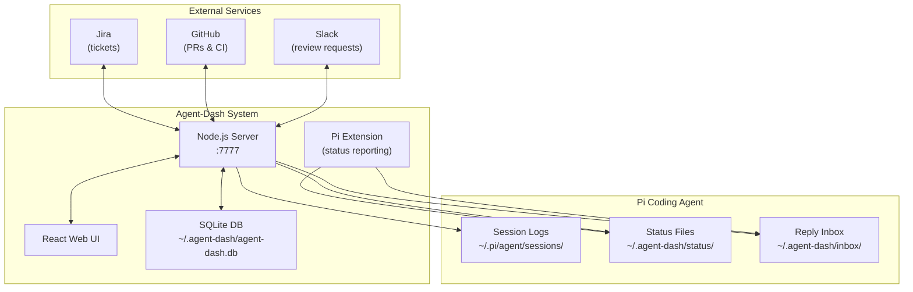

## Data Flow Architecture

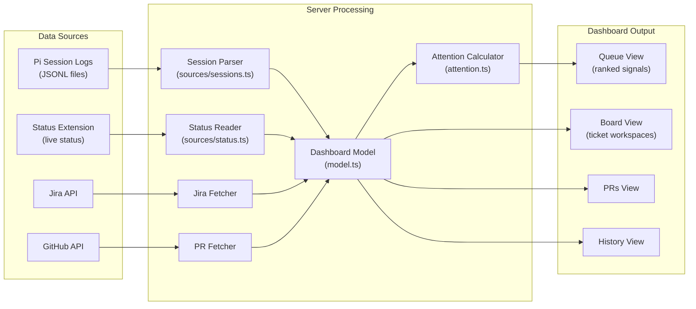

## Core Components

### 1. Server (`server/index.ts`)
The HTTP server that:
- Serves the web UI on `http://127.0.0.1:7777`
- Provides REST API endpoints for dashboard data
- Manages caching for external service calls
- Broadcasts changes via Server-Sent Events (SSE)

### 2. Data Sources (`server/sources/`)

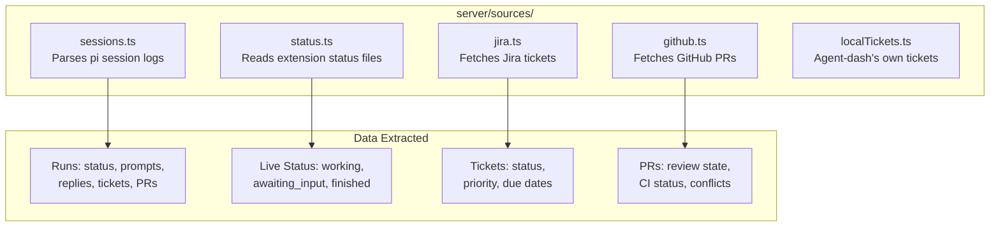

### 3. Attention System (`server/attention.ts`)

The attention calculator scores and ranks items that need your attention:

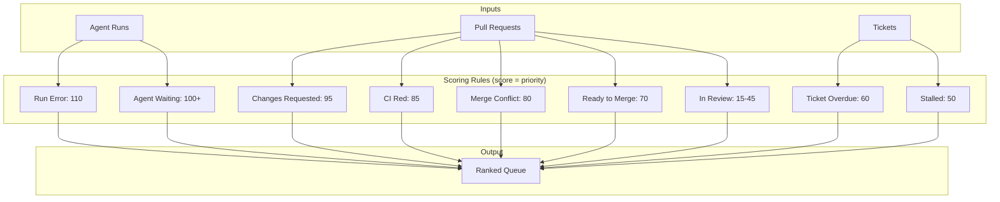

### 4. Extension System (`extension/agent-dash-status.ts`)

The pi extension enables bidirectional communication with live agents:

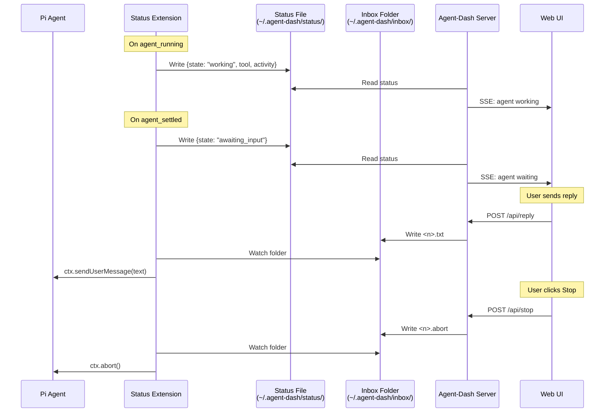

## Web UI Architecture

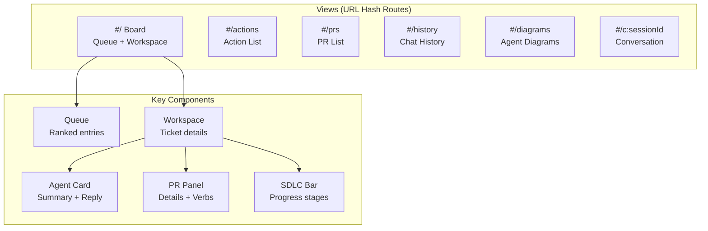

## Ticket-Centric Model

Everything links to tickets:

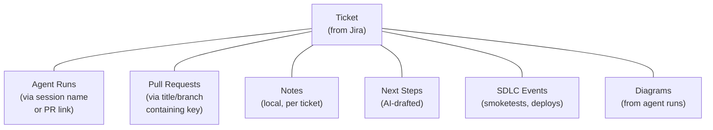

## SDLC Progress Tracking

```mermaid
flowchart LR
    s1["1. Ideation<br/>✓ always"]
    s2["2. PR Exists<br/>GitHub"]
    s3["3. Local Plan<br/>SQLite"]
    s4["4. Local Test<br/>SQLite"]
    s5["5. Review Req<br/>SQLite"]
    s6["6. In Beta<br/>SQLite"]
    s7["7. Beta Plan<br/>SQLite"]
    s8["8. Beta Test<br/>SQLite"]
    s9["9. In Prod<br/>SQLite"]
    s10["10. Prod Plan<br/>SQLite"]
    s11["11. Prod Test<br/>SQLite"]
    s12["12. Done<br/>Jira"]

    s1 --> s2 --> s3 --> s4 --> s5 --> s6 --> s7 --> s8 --> s9 --> s10 --> s11 --> s12
```

## SQLite Storage Schema

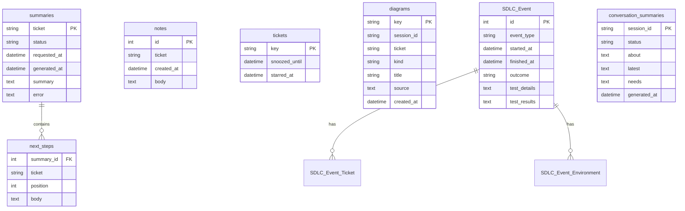

## API Routes

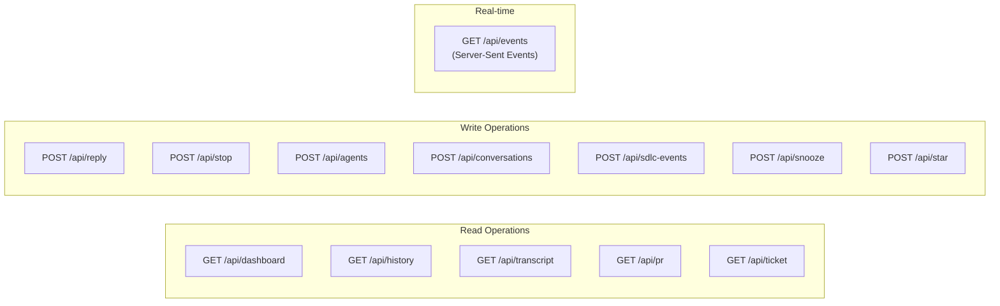

## Key Workflows

### Starting a New Agent

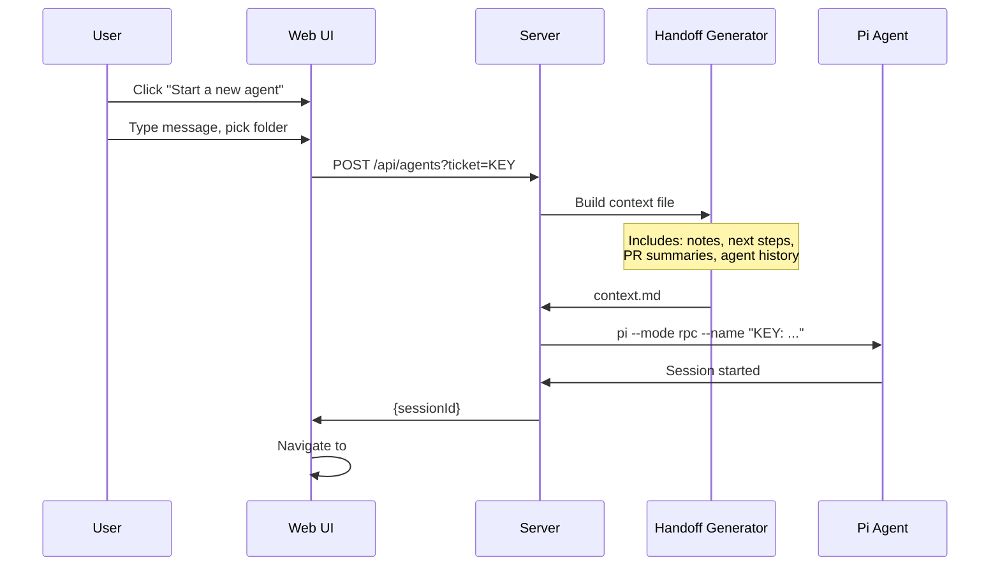

### Live Agent Control

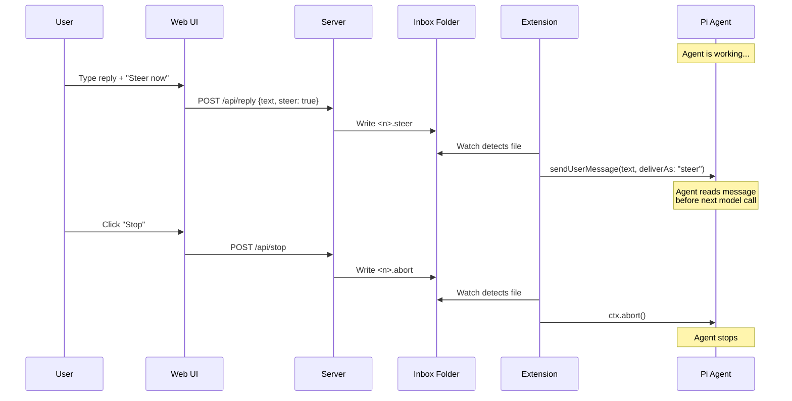

## Summary

Agent-dash provides:

1. **Unified View**: Aggregates pi sessions, Jira tickets, GitHub PRs, and Slack into one dashboard
2. **Smart Prioritization**: Scores and ranks everything by urgency so you know what to look at next
3. **Live Control**: Send replies, steer, and stop agents without switching to iTerm
4. **SDLC Tracking**: Tracks progress from ideation through production deployment
5. **AI Summaries**: Auto-generated summaries of agent conversations and next steps
6. **Diagram Collection**: Captures and displays charts/diagrams agents create

All data stays local (SQLite + file system), with external APIs called only for Jira/GitHub/Slack data.
