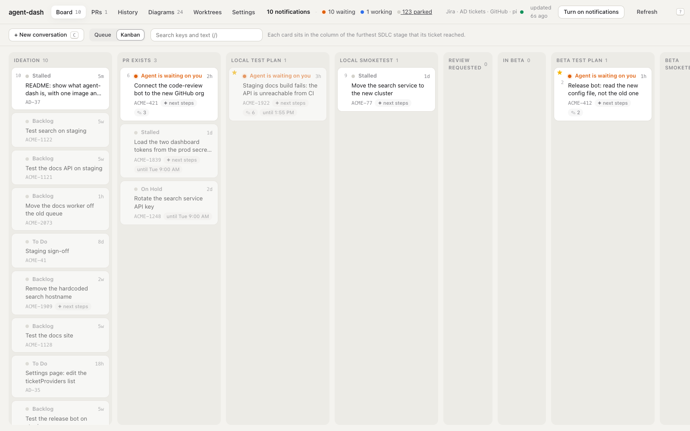
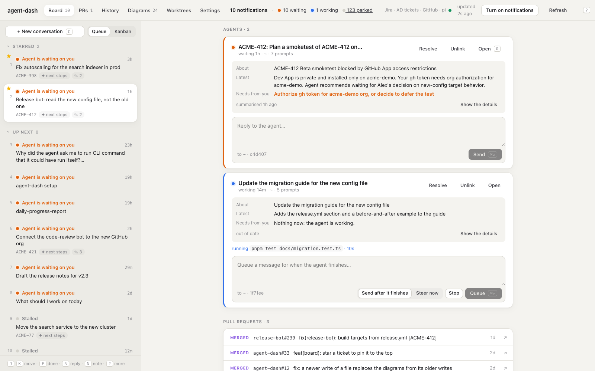
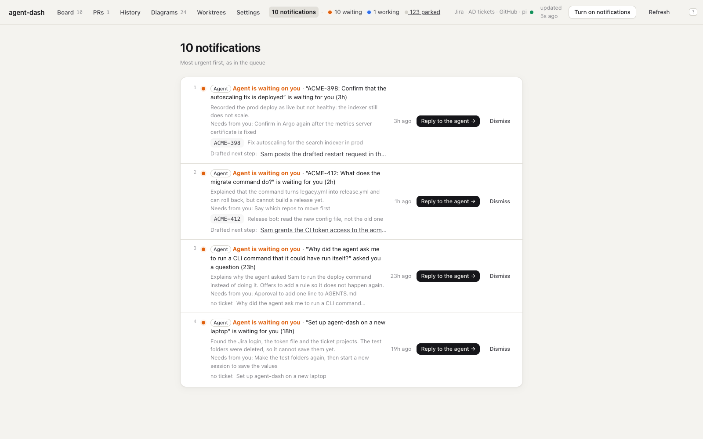
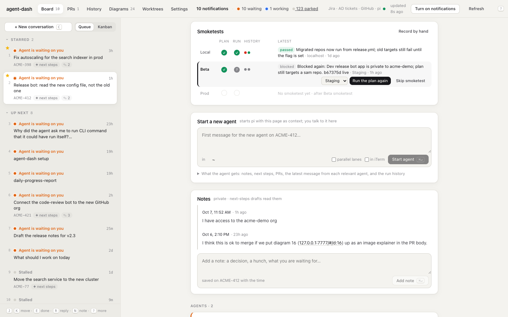
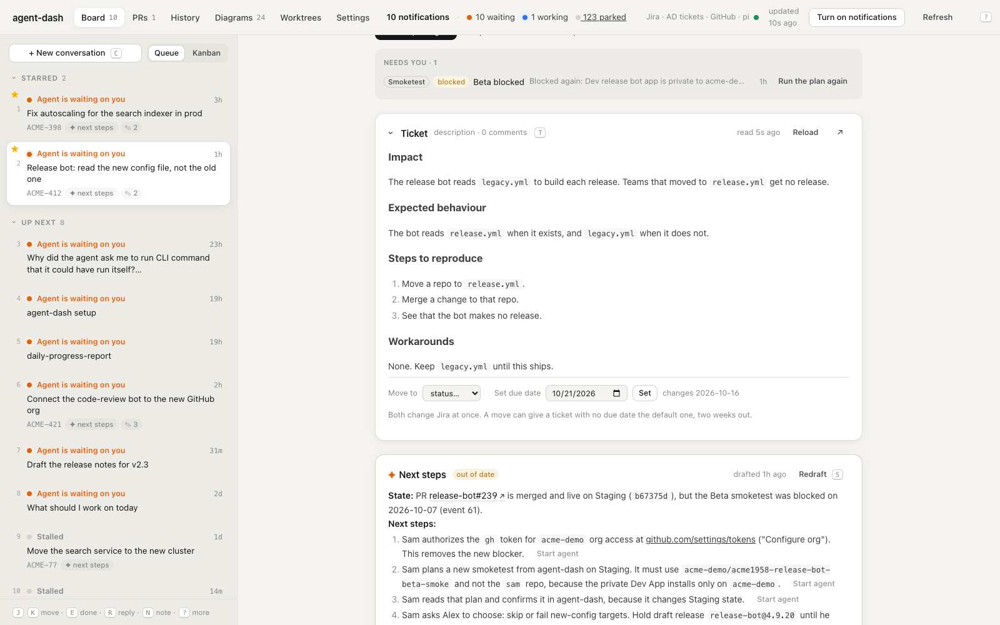
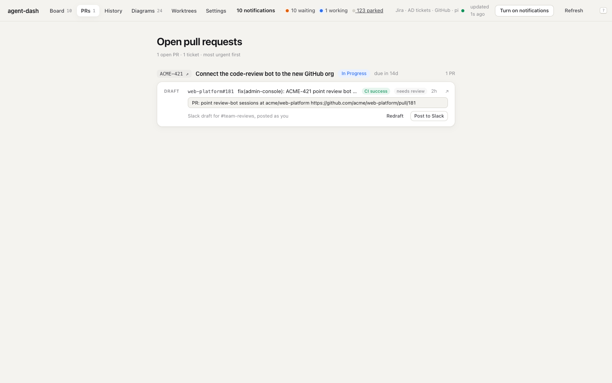
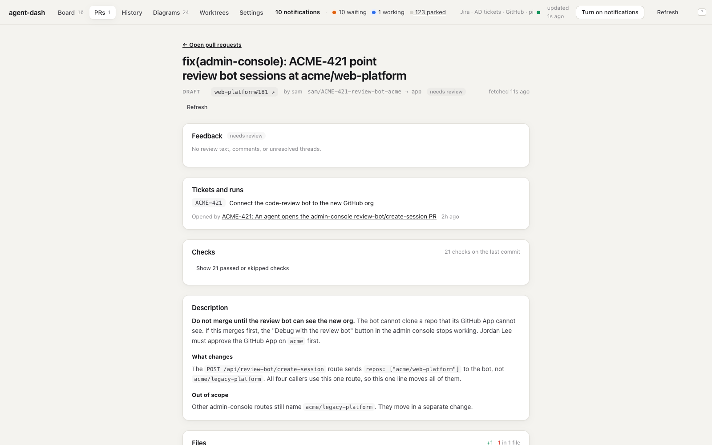
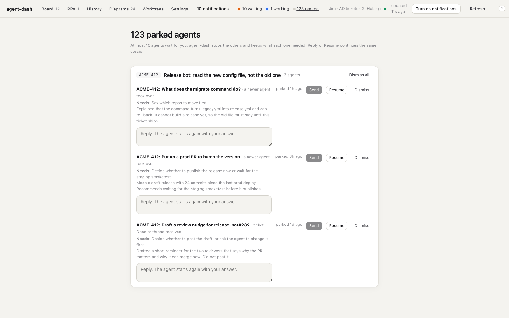
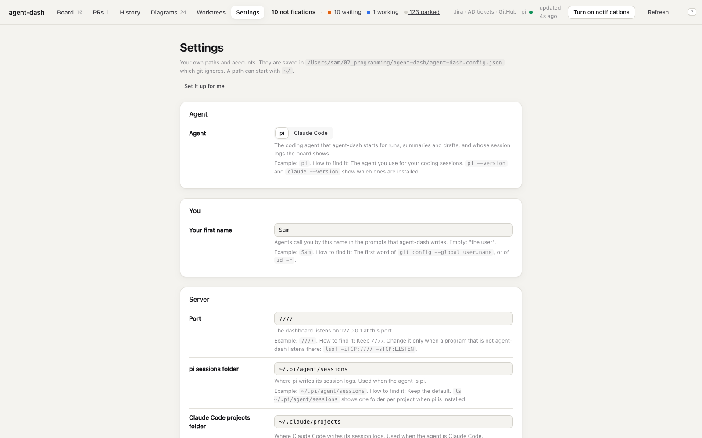

# What agent-dash can do

A ship's captain stays on the bridge. To change speed, the captain does not run to the engine room. The captain moves the engine telegraph, and the crew below does the work.

A developer who runs many coding agents leaves the bridge all the time: iTerm for the agents, Jira for tickets, GitHub for PRs and CI, Slack for reviews, Argo for deploys. agent-dash brings these controls to one page. You see the state of all your work, and you give each order from the same place. Your agents are the crew.

This page is a short tour. The [README](../README.md) is the full reference.

> The screenshots show fictional tickets, repos and people.

## The instruments: what you see

### One ranked queue

There is one entry per ticket, and the most urgent signal puts it first: an agent that waits for you, a red CI run, a review that asks for changes, a due date. The workspace on the right shows the selected ticket.

The **Kanban** layout shows the same tickets in columns, one column for each SDLC stage. → [Board](../README.md#board)

### Agent summaries

Each agent card has three lines: what the conversation is **about**, what the agent said **last**, and what it **needs from you**. You do not have to read the transcript. Reply, steer or stop the agent from the card. → [Conversation summaries](../README.md#conversation-summaries)

### Drafted next steps and the SDLC route

For each ticket, an agent reads Jira, the PRs, Slack and your notes, then writes the state, the next steps and the blockers. Each step has a **Start agent** button. A 12-stage bar shows where the change is on its way from idea to prod, and which stage is next. You can see both in the board screenshot above. → [Next-steps summaries](../README.md#next-steps-summaries), [SDLC progress](../README.md#sdlc-progress-and-smoketests)

### One list of what needs you

The notifications list is in queue order. Each entry says what the agent did, what it needs, and has one button to the place where you act. Chrome notifications come one per ticket, not one per agent. → [Notifications](../README.md#notifications)

## The controls: what you do from the page

### Start and steer agents

Start an agent with the ticket context already loaded, or open a plain conversation. You talk to it on the page, so you do not need a terminal tab. → [Conversations on the page](../README.md#conversations-on-the-page)

### Smoketests

An agent writes a test plan first. A plan that changes a shared environment waits for your **Confirm**. Each environment shows its plan, its run, and the history of its runs. The same screenshot shows **Start a new agent** and your private notes. → [SDLC progress and smoketests](../README.md#sdlc-progress-and-smoketests)

### Tickets

Read the Jira description, move the status, and set a due date. → [The ticket section](../README.md#the-ticket-section)

Keep the ticket's documentation on its page: markdown with mermaid diagrams and images. One click has an agent write a ticket summary, with the start, middle and end states and user stories. **Edit** with a prompt has an agent rewrite a document in place. → [Documentation](../README.md#documentation)

### PRs and reviews

See your open PRs by ticket, each with a drafted review request. **Post to Slack** sends it. → [PRs](../README.md#prs)

The PR panel shows feedback, checks (with the end of a failed job log), the description and the files, without GitHub. When a PR needs something, one button starts an agent on it: **Fix CI**, **Address review**, **Rebase**, **Merge** or **Draft a nudge**. → [PR panel](../README.md#pr-panel), [PR verbs](../README.md#pr-verbs)

## The safety rules

- It runs on your machine only (`127.0.0.1`). Your notes stay local.
- Each write starts with your click, and the click is your approval. It writes to Jira (a status or a due date) and Slack (a review request) only. It never writes to GitHub itself: a PR verb starts an agent, and the agent does that one task.
- A smoketest plan that changes a shared environment waits for your **Confirm**.
- At most 15 agents wait for you at one time. agent-dash parks the others and keeps what each one needed, so no question gets lost. → [Parked agents](../README.md#parked-agents)

## Set it up

Pick **pi** or **Claude Code** as the agent. Each setting shows an example and how to find it, or **Set it up for me** starts an agent that finds them. → [Run it](../README.md#run-it), [Configuration](../README.md#configuration)

